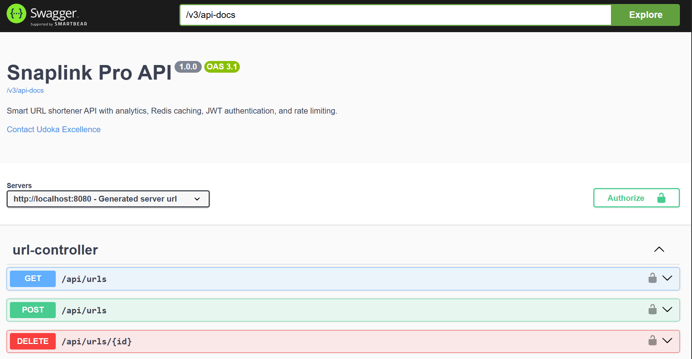
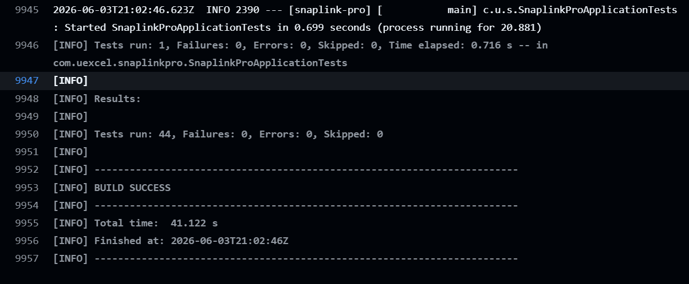
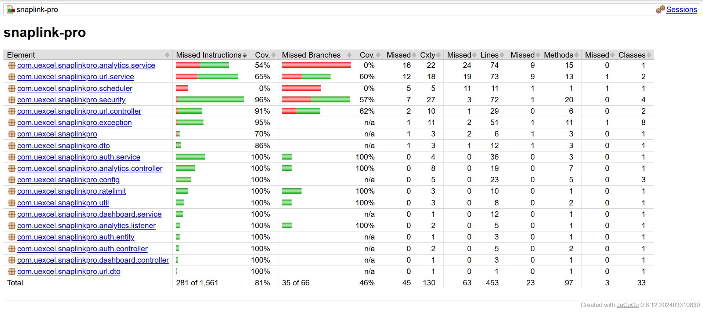

# 🚀 SnapLink Pro - Production Ready URL Shortener with Analytics


## Overview

SnapLink Pro is a production-ready URL shortener REST API built with Spring Boot. It allows users to convert long URLs into short, shareable links while tracking click analytics and usage statistics.

The application is designed with security, scalability, and maintainability in mind, featuring JWT authentication, Redis caching, rate limiting, analytics tracking, and comprehensive automated testing.

---

## Project Highlights

- JWT Authentication & Authorization
- Redis Caching
- URL Analytics & Dashboard
- Rate Limiting
- PostgreSQL Persistence
- GitHub Actions CI
- JaCoCo Code Coverage
- 44 Automated Tests
- 81% Instruction Coverage

---

## Repository

[SnapLink Pro Repository](https://github.com/Uexcel2022/snaplink-pro)

---

## Screenshots


### Swagger Documentation




### GitHub Actions Pipeline




### JaCoCo Coverage Report




## Features

### Authentication & Security

* User registration and login
* JWT-based authentication
* Protected API endpoints
* Role-based authorization support
* Global exception handling

### URL Management

* Shorten long URLs
* Custom aliases
* Delete owned URLs
* User-specific URL management
* Expiration support

### Redirect Engine

* Fast URL redirection
* Redis-backed URL caching
* Click tracking
* Rate limiting protection

### Analytics

* Total click statistics
* Browser analytics
* Device analytics
* Click trend reporting
* Top performing URLs

### Dashboard

* Total URLs
* Active URLs
* Expired URLs
* Total clicks

---

## Tech Stack

### Backend

* Java 21
* Spring Boot 3
* Spring Security
* Spring Data JPA
* Hibernate

### Database

* PostgreSQL
* H2 (Testing)

### Caching

* Redis

### Authentication

* JWT (JSON Web Token)

### Documentation

* OpenAPI / Swagger

### Testing

* JUnit 5
* Mockito
* Spring Boot Test
* MockMvc

### Deployment

* Docker
* Docker Compose

---
## Architecture

```text
Controller Layer
       ↓
Service Layer
       ↓
Repository Layer
       ↓
PostgreSQL Database

Supporting Components:
- JWT Authentication
- Redis Cache
- Analytics Event Processing
- Rate Limiting
- Global Exception Handling
```

---

## API Endpoints

### Authentication

`POST /api/auth/register`

`POST /api/auth/login`

### URLs

`POST /api/urls`

`GET /api/urls`

`DELETE /api/urls/{id}`

### Redirect

`GET /{shortCode}`

### Analytics

`GET /api/analytics/{urlId}`

`GET /api/analytics/top-urls`

`GET /api/analytics/{urlId}/browsers`

`GET /api/analytics/{urlId}/devices`

`GET /api/analytics/{urlId}/trends`

### Dashboard

`GET /api/dashboard/summary`

---

## API Documentation

Swagger UI is available when the application is running:

`http://localhost:8080/swagger-ui/index.html`

---

## Running Locally

### Clone Repository

```bash
git clone https://github.com/Uexcel2022/snaplink-pro.git

cd snaplink-pro
```

### Start Dependencies

docker compose up -d

### Run Application

mvn spring-boot:run

### Run Tests

mvn clean verify

---

## Test Results

Latest Test Execution (2026-06-03)

BUILD SUCCESS

Tests Run: 44

Failures: 0

Errors: 0

Skipped: 0

Execution Time: 46.286 seconds

Completed Integration Tests:

* AuthController
* UrlController
* RedirectController
* AnalyticsController
* DashboardController

Completed Unit Tests:

* AuthService
* UrlService
* DashboardService
* RateLimitService

---

## CI/CD & Quality Assurance

### Continuous Integration

SnapLink Pro uses GitHub Actions to automatically:

* Build the application
* Run unit tests
* Run integration tests
* Verify build integrity
* Generate JaCoCo coverage reports

### Code Coverage

JaCoCo Coverage Report:

* Instruction Coverage: 81%
* Classes Covered: 30/33
* Automated Unit & Integration Testing

### Latest Quality Metrics

BUILD SUCCESS

Tests Run: 44

Failures: 0

Errors: 0

Skipped: 0

GitHub Actions Status: Passing

---

## Future Improvements

### Deployment & DevOps

* Cloud deployment (Render/AWS)
* Continuous Deployment (CD)
* Docker image publishing
* Health monitoring

### Product Enhancements

* Custom domains
* QR code generation
* User roles and administration
* Geo-location analytics
* API rate limit dashboard

### Testing

* Testcontainers integration
* Increased branch coverage
* Performance and load testing

---

## Live Demo

Coming Soon (Render Deployment)

---

## Author

Udoka Excellence

Software Engineer | Java & Spring Boot Developer
